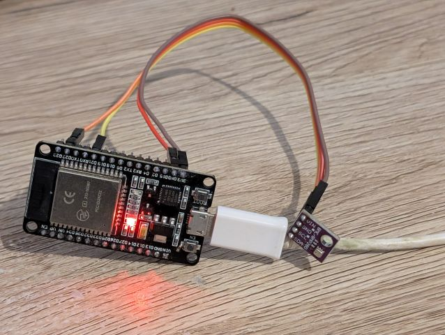
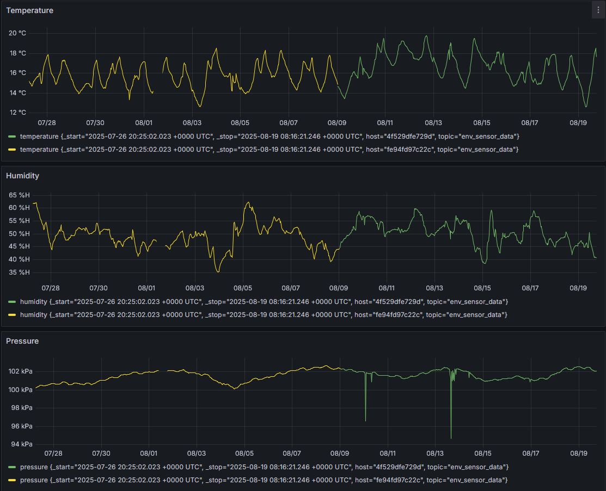

# Air Sensei

## Overview

Air Sensei is an ESP32-based IOT temperature sensor platform. It interfaces with sensors to collect environmental data such as temperature, pressure, and humidity, and publishes this information over MQTT.

It uses the ESP-IDF framework, and Bosch BME280 driver code and is based on example code supplied by the ESP-IDF framework.


## Setup

### Hardware Required

To run this software, you should have one ESP32, ESP32-S, ESP32-C or ESP32-H based development board as well as a BME280



### Setup

Run the following commands to setup:

1. Checkout this repository and its dependencies:
    ```bash
    git clone https://github.com/slavistas/air-sensei.git
    git clone https://github.com/espressif/esp-idf.git
    (cd air-sensei && git submodule update --init --recursive)
    ```
2. Setup esp-idf repo according to it's README:
    ```bash
    cd esp-idf
    git submodule update --init --recursive
    ./install.sh
    cd ../
    ```

See the [Getting Started Guide](https://docs.espressif.com/projects/esp-idf/en/latest/get-started/index.html) for full steps to configure and use ESP-IDF to build projects.

### Build

1. Export ESP-IDF Framework
    ```bash
    source esp-idf/export.sh
    ```
4. Configure air-sensei menuconfig settings
    ```bash
    cd air-sensei
    idf.py menuconfig
    ```

    Main Configuration ->
    - (22) SCL GPIO Num
    - (21) SDA GPIO Num
    - (mqtt://mqttbroker.com) MQTT Broker URL
    - (pool.ntp.org) Address of SNTP server
    - (Garage) Name of Sensor Location (General)
    - (ACST-9:30ACDT,M10.1.0,M4.1.0/3) Timezone Location String
        See for timezone codes: https://github.com/nayarsystems/posix_tz_db/blob/master/zones.csv
    - (10000) Time between publishing MQTT measurements, measured in ms

    Wifi Component Configuration ->
    - (SSID) WiFi SSID
    - (PASSWORD) WiFi Password

5. Build air-sensei
    ```bash
    idf.py build
    ```
### Flash

1. Connect an ESP32 Device to your computer
2. Enter the following command to build, flash, and monitor the project.

    ```bash
    idf.py -p PORT flash monitor
    ```

To exit the serial monitor, type ``Ctrl + ]``


## Example Output

This is an output of the serial console attached to the device:
```bash
user@hostname:~$ tio /dev/ttyUSB0 -b 115200
[tio 23:25:20] tio v1.32
[tio 23:25:20] Press ctrl-t q to quit
[tio 23:25:20] Connected
I (4929171) MQTT_BME280: The current date/time in Adelaide is: Thu Oct 23 12:55:27 2025 GMT
I (4929171) MQTT_BME280: Double Precision: {"time": "Thu Oct 23 12:55:27 2025 GMT", "MAC": "b0:b2:1c:a7:c4:d4", "temperature": 19.820527, "humidity": 46.303349, "pressure": 101169.567825}
I (4929201) MQTT_BME280: MQTT_EVENT_PUBLISHED, msg_id=52920
I (4939441) MQTT_BME280: The current date/time in Adelaide is: Thu Oct 23 12:55:38 2025 GMT
I (4939441) MQTT_BME280: Double Precision: {"time": "Thu Oct 23 12:55:38 2025 GMT", "MAC": "b0:b2:1c:a7:c4:d4", "temperature": 19.891649, "humidity": 46.145645, "pressure": 101169.594131}
I (4939461) MQTT_BME280: MQTT_EVENT_PUBLISHED, msg_id=60933
I (4949711) MQTT_BME280: The current date/time in Adelaide is: Thu Oct 23 12:55:48 2025 GMT
I (4949711) MQTT_BME280: Double Precision: {"time": "Thu Oct 23 12:55:48 2025 GMT", "MAC": "b0:b2:1c:a7:c4:d4", "temperature": 19.824604, "humidity": 46.229233, "pressure": 101171.911924}
I (4949731) MQTT_BME280: MQTT_EVENT_PUBLISHED, msg_id=61734
I (4959981) MQTT_BME280: The current date/time in Adelaide is: Thu Oct 23 12:55:58 2025 GMT
I (4959981) MQTT_BME280: Double Precision: {"time": "Thu Oct 23 12:55:58 2025 GMT", "MAC": "b0:b2:1c:a7:c4:d4", "temperature": 19.904133, "humidity": 46.189880, "pressure": 101172.230851}
I (4960011) MQTT_BME280: MQTT_EVENT_PUBLISHED, msg_id=2218
```

This is an output as received by the MQTT broker:
```bash
user@hostname:~$ mosquitto_sub -t env_sensor_data
{"time": "Thu Oct 23 12:51:31 2025 GMT", "MAC": "b0:b2:1c:a7:c4:d4", "temperature": 20.167844, "humidity": 45.461528, "pressure": 101166.557789}
{"time": "Thu Oct 23 12:51:41 2025 GMT", "MAC": "b0:b2:1c:a7:c4:d4", "temperature": 20.084186, "humidity": 45.506805, "pressure": 101164.636625}
{"time": "Thu Oct 23 12:51:31 2025 GMT", "MAC": "b0:b2:1c:a7:c4:d4", "temperature": 20.167844, "humidity": 45.461528, "pressure": 101166.557789}
{"time": "Thu Oct 23 12:52:02 2025 GMT", "MAC": "b0:b2:1c:a7:c4:d4", "temperature": 20.079121, "humidity": 45.608930, "pressure": 101163.000503}
```

This is an image of environmental data displayed using Grafana:



Note: this is an example of how these sensors can be employed and requires additional software to setup.